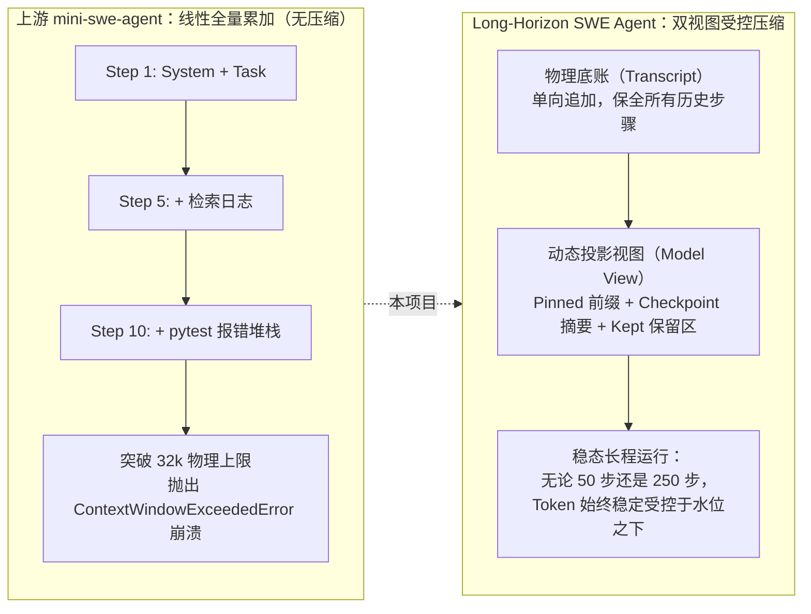
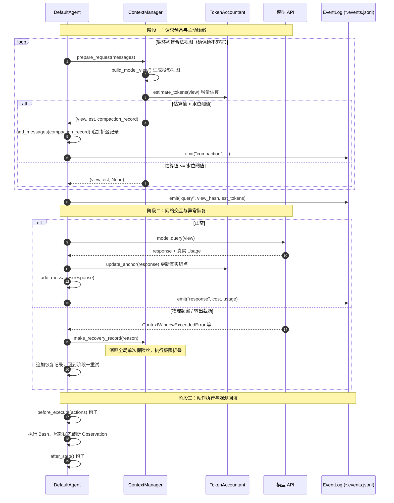

# Long-Horizon SWE Agent

<p align="center">
  <a href="https://github.com/sylenshi/long-horizon-swe-agent/blob/main/LICENSE.md"></a>
  <a href="https://www.python.org/downloads/"></a>
  <a href="https://github.com/SWE-agent/mini-swe-agent"></a>
  <a href="https://github.com/astral-sh/ruff"></a>
</p>

<p align="center">
  <b><a href="README.md">中文</a></b> | <b><a href="README_en.md">English</a></b>
</p>

> 长程 AI 软件工程智能体：基于原mini-swe-agent项目，在不影响agent轨迹记录功能的前提下完善了上下文压缩机制，使mini-swe-agent具备了在长程软件工程benchmark(如swe-marathon)下进行评测任务的能力。

Long-Horizon SWE Agent（仓库 `long-horizon-swe-agent`）是 [mini-swe-agent](https://github.com/SWE-agent/mini-swe-agent) 的二次开发项目。
上游用不到一百行 Python 实现了一个极简、高性能的 bash-only 软件工程智能体；本项目在完整保留这套极简骨架的前提下，
参考现代工业级 coding agent [pi](https://github.com/earendil-works/pi) 的 harness 设计经验，
为它补上了长时程任务最缺的东西——**受控的上下文与完整的可观测性**，让同一个智能体可以在极小的模型窗口下稳定跑完数百步的排错任务。

> 📖 **深入设计白皮书**：关于长时程上下文管理与观测体系的设计动机、纯函数双视图、`fold-v1` 确定性折叠算法、混合计账状态机以及生产配置校准等详细细节，请参阅：[上下文管理与观测体系详解.md](./上下文管理与观测体系详解.md)。

| | 上游 mini-swe-agent | Long-Horizon SWE Agent |
| :--- | :--- | :--- |
| 上下文策略 | 全量历史线性追加（Transcript is the Prompt） | 双视图：追加式底账 + 纯函数投影视图 |
| 超窗行为 | 32k 窗口约 8~10 轮触发 `ContextWindowExceededError` 崩溃，任务中断 | 水位线主动折叠，实测 250 步零物理溢出 |
| 历史数据 | 轨迹即 Prompt | 底账永不删改，完整保留用于复盘与微调 |
| 可观测性 | 轨迹文件 | 额外产出 `*.events.jsonl` 全生命周期审计流 |
| 恢复机制 | 无 | 单次恢复保险丝（one-shot recovery fuse） |

## 为什么做这个项目

在端到端软件缺陷修复任务中，智能体需要在沙箱内自主探索代码库、复现 Bug、运行测试套件，动辄需要几十甚至上百个交互步。
而上游 mini-swe-agent 采用全量历史线性追加机制，Prompt 长度随步数线性增长：

- 在 32k 上下文窗口限制下，交互仅进行 **8~10 轮**即触发物理爆窗异常（`ContextWindowExceededError`）；
- 原生框架没有针对超窗的恢复机制，任务直接崩溃中断，无法完成 30 步以上的长程排错；
- 直接就地删减历史又会破坏轨迹的完整性，污染后续微调与复盘数据。



Long-Horizon SWE Agent 的解法不是"把历史删掉"，而是**把"记什么"和"给模型看什么"拆成两层**，详见下文[架构总览](#架构总览)。

## 核心能力

1. **确定性上下文折叠（`fold-v1`）**：纯规则、零额外 LLM 调用的确定性摘要算法。基于命令模式与正则解析，把历史交互步骤浓缩为"关键命令 + 状态转移"的单行条目（每条约 25~40 Token），毫秒级完成，无网络开销、无摘要幻觉。
2. **双视图架构**：物理底账（`self.messages`）单向追加、永不删改；模型视图由纯函数 `build_model_view()` 从底账动态投影而来。轨迹数据 100% 完整，Prompt 却始终受控。
3. **阈值主动压缩 + 单次恢复保险丝**：请求发出前，若 Token 估算超过水位线（默认窗口的 80%）即触发折叠；若模型服务端仍然抛出硬性超窗/截断异常，消耗全局仅一次的保险丝执行极限折叠后重试，而不是崩溃退出。
4. **全生命周期观测**：独立产出 `*.events.jsonl` 审计流，逐条记录 `run_start / query / response / compaction / hook / exit` 事件，含每次请求的 `view_hash` 指纹、真实计费 Usage 与耗时，任务结束即可完整复盘。
5. **四个无侵入生命周期钩子**：`before_query` / `after_model_response` / `before_execute` / `after_step`。不改动主循环，派生子类即可挂载安全检查、拦截策略或自定义观测。

## 架构总览

### 单步执行流

升级后的智能体循环采用"主动预防式压缩 + 被动响应式恢复"的双层防御：



### 双视图：底账与模型视图

物理底账只追加、不删改；模型视图是底账的纯函数投影，划分为三个区域：

- **固定前缀区（Pinned Prefix）**：System Prompt 与任务描述，绝对豁免，任何压缩算法不得折叠；
- **折叠检查点（Checkpoint）**：由最新的 `role: compaction` 记录包装为标准 user 消息注入视图；
- **近期活跃区（Kept-recent）**：从切割索引 `cut_index` 起的最近若干完整交互步骤，保留当下推理链。

切割索引严格依循 `split_action_groups()` 的**动作组原子性约束**：assistant 动作与其 observation 绑定为同一组（tool-call 模式下 `tool_calls` 与 `tool` 响应同组），**切割绝不落在动作组内部**，杜绝协议残缺引发 API 报错。底账中标记 `extra.discarded` 的诊断消息由投影引擎自动剥离，仅供审计。

### 折叠前后的 Prompt 长什么样

任务执行到第 15 步、Token 估算触及 80% 水位线时自动触发折叠，模型实际收到的 Prompt 变化如下：

```markdown
<!-- 折叠前：数十步历史堆叠，逼近物理极限 -->
[system] You are a helpful software engineering agent...
[user] Issue description: Fix AttributeError in sqlglot/optimizer...
[assistant] Step 1: Let's locate the file...
[user] Observation: sqlglot/optimizer/eliminate_subqueries.py
... （中间连续 13 个步骤的完整代码展开与 pytest 报错堆栈）...
[assistant] Step 14: Let's inspect line 40...
[user] Observation: return node.args["alias"].this

────────────── 触发主动折叠 ──────────────

<!-- 折叠后：build_model_view() 投射给模型的实际视图 -->
[system] You are a helpful software engineering agent...      （完整保留）
[user] Issue description: Fix AttributeError in ...           （完整保留）

[user] <context-compaction>
The earlier conversation was automatically compacted to fit the context window.
Below is a deterministic summary of everything that happened before the recent steps.
[compacted steps | strategy=fold-v1 | reason=threshold]
files read: tests/test_optimizer.py, sqlglot/expressions.py
files modified: sqlglot/optimizer/eliminate_subqueries.py
files touched: -
[step 1] rc=0 cmd: git status
  out: On branch main
[step 3] rc=1 cmd: pytest tests/test_optimizer.py
  out: FAILED test_subquery - AttributeError: 'NoneType' object has no attribute 'this'
[step 7] rc=0 cmd: grep -n "eliminate_subqueries" sqlglot/
  out: 12:def eliminate_subqueries(expression):
... （历史步骤浓缩为关键命令与状态转移）...
</context-compaction>

[assistant] Step 14: Let's inspect line 40...                 （保留区开始）
[user] Observation: return node.args["alias"].this
```

折叠条目将 Action 与 Observation 绑定为原子因果对（`[step N] rc=... cmd: ... out: ...`），并将涉及的文件归入 `modified`（被 `sed -i`、`>` 重定向等改变）/ `read`（被 `cat`、`grep`、`pytest` 读取）/ `touched`（兜底）三类，明确标记已排查边界，防止模型陷入遗忘性重复搜索。即使保留满 32 条历史步骤，Checkpoint 总消耗也仅约 1,120 Token（32k 窗口的 3.4%）。

若 Checkpoint 摘要超出预算配额，系统执行**五级自适应收缩阶梯**：压缩日志输出行数 → 截断历史条目数（留最近 4 步）→ 剔除 read 清单 → 极端收缩至最近 1 步 → 仅保留元数据表头。

### 混合计账（TokenAccountant）

"真实 Usage 锚定 + 增量字符估算"的状态机：首个成功请求返回的真实 `prompt_tokens` 作为锚点，其后只需对增量区间做字符估算；每次折叠使旧锚点失效，自动回退到全量字符估算，并在下一次 API 响应后重新锚定。

关键参数 `chars_per_token` 默认冻结为 **2.6**。常规英文文本约 4 字符/Token，但代码交互日志充满缩进、特殊符号与 JSON 转义，实测拟合比率为 2.25~3.69；沿用 4.0 会系统性低估约 35%，压缩触发偏晚直至物理爆窗。宁可保守高估、提前一步压缩，也不给底层网络留出爆窗间隙。

## 快速开始

**安装**

```bash
git clone https://github.com/sylenshi/long-horizon-swe-agent.git
cd long-horizon-swe-agent
pip install -e .
```

> **生态兼容性说明**：本项目在 `pyproject.toml` 中命名为 `long-horizon-swe-agent`，为了 100% 保持与上游生态及 SWE-bench 官方评测脚本的无缝兼容，保留了 `mini` 命令行入口与 `minisweagent` Python 导入命名空间。

**运行**（用法与上游 mini-swe-agent 一致，`mini` CLI、Python bindings、SWE-bench 批量评测均可用）

```bash
export OPENAI_API_KEY=...   # 或 OPENROUTER_API_KEY 等，见上游文档
mini                        # 交互式 CLI
```

**启用上下文管理**

默认 `window_tokens: 0`，行为与上游完全一致（不压缩）。设置窗口大小即启用：

```yaml
# 32k 推荐生产配置
agent:
  context:
    window_tokens: 32768      # 启用上下文管理；0 为关闭
    reserve_tokens: 6553      # 预留输出空间（默认 window // 5，即 80% 水位线）
    keep_recent_tokens: 8192  # 近期完整保留区（默认 window // 4）
    chars_per_token: 2.6      # 估算系数，换模型时建议重新校准
  obs_max_chars: 12000        # 单条观测截断上限（尾部优先保留）
  obs_max_lines: 400
```

```yaml
# ≤12k 极小窗口防 Churn 配置
agent:
  context:
    window_tokens: 12288
    reserve_tokens: 2457
    keep_recent_tokens: 3072
    chars_per_token: 2.6
  obs_max_chars: 6000         # 小窗下必须等比压小，防止单条输出瞬间顶破水位
  obs_max_lines: 200
```

也可用命令行即时覆盖：`mini -c agent.context.window_tokens=16384`。完整参数见 `src/minisweagent/config/benchmarks/swebench.yaml` 中的注释示例与[详细文档](./上下文管理与观测体系详解.md)。

## 实测验证

**离线确定性重放**：10 条真实历史长轨迹 × {8k, 16k, 32k} 三档窗口共 30 次重放，全部零超预算；压缩触发频次随窗口收紧严格单调递增；70 步极限轨迹在 32k 窗口下峰值 Token 压制在 25,208（余量 >23%）。

**在线 12k 极小窗口冒烟**（SWE-smith 真实任务端到端实跑）：

| 任务 | 退出状态 | 步数 | 压缩次数 | Token 峰值 | 费用 |
| :--- | :---: | :---: | :---: | :---: | :---: |
| parsimonious.func_basic | Submitted | 16 | 2 | 9,399 | $0.046 |
| python-qrcode.combine_file | Submitted | 28 | 10 | 9,719 | $0.144 |
| sqlglot.func_pm_ctrl_shuffle | Submitted | 19 | 9 | 9,821 | $0.122 |
| sqlglot.func_pm_remove_loop | 步数上限 | 250 | 199 | 9,874 | $2.117 |

4 条任务累计 **220 次在线主动压缩、0 次物理溢出、0 次保险丝消耗**；250 步极限场景下 Token 始终稳定在 9,800 左右。稳态计账偏差 +2.6%~+8.2%（偏保守高估，安全方向）。

**回归测试**：针对上下文模块的 45 个专项测试全绿；上游全量回归测试逐项核对，确认零回归缺陷引入。

## 致谢与上游项目

**[mini-swe-agent](https://github.com/SWE-agent/mini-swe-agent)（Princeton & Stanford 的 SWE-agent 团队）**
本项目 fork 自 mini-swe-agent，保留了上游的全部核心设计——异常驱动的极简控制流、bash 单一动作空间、`subprocess.run` 独立执行、完全线性追加的轨迹、无人值守批量评测基建——新增代码集中在 `src/minisweagent/context/` 模块（投影、计账、折叠、事件、总控）与 `DefaultAgent` 的视图投递接入点，对既有类不做破坏性修改。感谢上游团队的工作！

**[pi](https://github.com/earendil-works/pi)（Earendil）**
本项目的上下文压缩机制参考了 pi 这款现代工业级 coding agent 的 harness 设计：底账与模型视口的双视图解耦、真实 Usage 锚定的增量计账、闭环压缩与容错自愈、无侵入生命周期钩子等核心思想均借鉴于此。在此基础上，本项目有意舍弃了 pi 中更重的机制（Durable 事务状态机、会话树与分支摘要、TUI 交互界面），并将摘要落地为**零 LLM 调用的确定性规则折叠**（fold-v1），以保持 mini 家族的极简气质。

如果本项目对你有帮助，请考虑引用 mini-swe-agent 团队的论文：

```bibtex
@inproceedings{yang2024sweagent,
  title={{SWE}-agent: Agent-Computer Interfaces Enable Automated Software Engineering},
  author={John Yang and Carlos E Jimenez and Alexander Wettig and Kilian Lieret and Shunyu Yao and Karthik R Narasimhan and Ofir Press},
  booktitle={The Thirty-eighth Annual Conference on Neural Information Processing Systems},
  year={2024},
  url={https://arxiv.org/abs/2405.15793}
}
```

上游的完整使用文档（`mini` CLI、模型配置、沙箱环境、批量评测等）同样适用于本项目，见 [mini-swe-agent.com](https://mini-swe-agent.com/)。

## 深入阅读

- [上下文管理与观测体系详解](./上下文管理与观测体系详解.md) —— 架构拆解、算法细节、计账机制、配置校准指南

## 开发与测试

```bash
pip install -e ".[dev]"

# 快速运行上下文管理核心专项测试（45 个测试，纯离线秒级执行，无需沙箱与 API Key）
pytest tests/context/

# 运行全量单元测试
pytest tests/
```

注：原上游套件中依赖 docker / singularity / bubblewrap / modal 等外部沙箱或云凭据的测试已从本仓库移除，其余单元测试全部通过。

## 许可证

MIT（继承自上游，见 [LICENSE.md](LICENSE.md)）。
