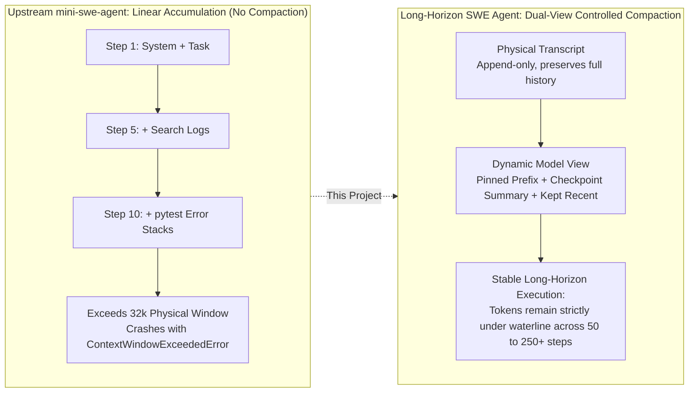
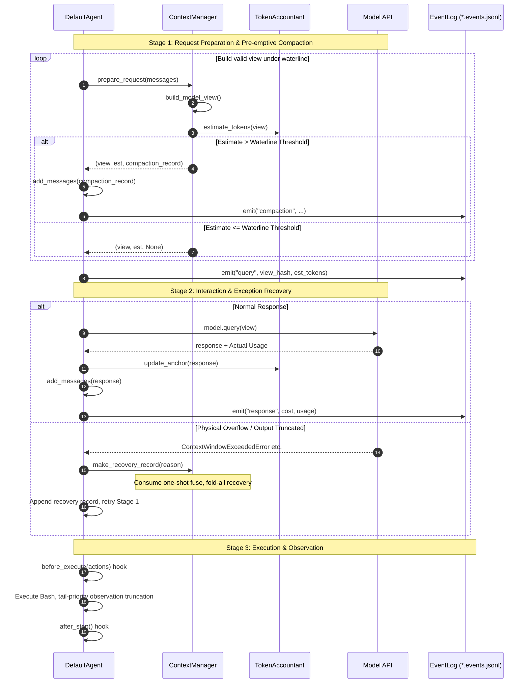

# Long-Horizon SWE Agent

<p align="center">
  <a href="https://github.com/sylenshi/long-horizon-swe-agent/blob/main/LICENSE.md"></a>
  <a href="https://www.python.org/downloads/"></a>
  <a href="https://github.com/SWE-agent/mini-swe-agent"></a>
  <a href="https://github.com/astral-sh/ruff"></a>
</p>

<p align="center">
  <b><a href="README.md">中文</a></b> | <b><a href="README_en.md">English</a></b>
</p>

> A Long-Horizon AI Software Engineering Agent: 250 steps without context overflow under a tight 12k context window.

Long-Horizon SWE Agent (`long-horizon-swe-agent`) is a context-managed fork and evolution of [mini-swe-agent](https://github.com/SWE-agent/mini-swe-agent).
Upstream implemented a minimal, high-performance, bash-only software engineering agent in under a hundred lines of Python. Retaining upstream's minimalist skeleton, this project incorporates harness design principles from modern industrial-grade coding agents like [pi](https://github.com/earendil-works/pi), equipping the agent with **controlled context management and full-lifecycle observability** to reliably complete hundreds of troubleshooting steps under tight context window limits.

> 📖 **In-Depth Design Paper**: For architectural motivations, pure function dual-views, the deterministic `fold-v1` folding algorithm, hybrid accounting state machine, and production calibration guides, see: [上下文管理与观测体系详解.md](./上下文管理与观测体系详解.md).

| | Upstream mini-swe-agent | Long-Horizon SWE Agent |
| :--- | :--- | :--- |
| **Context Strategy** | Linear append-only history ("Transcript is the Prompt") | Dual-view: Append-only transcript + Pure function model view |
| **Overflow Behavior** | Crashes with `ContextWindowExceededError` around 8~10 steps in a 32k window | Active waterline folding; 0 physical overflows across 250 steps |
| **Historical Data** | Trajectory == Prompt | Transcript is never mutated or truncated; fully preserved for SFT & review |
| **Observability** | Trajectory file | Additional `*.events.jsonl` full lifecycle audit stream |
| **Recovery** | None | One-shot recovery fuse |

## Why This Project

In end-to-end software defect repair tasks, an agent explores codebases, reproduces bugs, and runs test suites autonomously inside a sandbox—often requiring dozens or even hundreds of steps.
Upstream mini-swe-agent uses linear appending where prompt length grows linearly with interaction steps:

- In a 32k context window, a hard physical window overflow (`ContextWindowExceededError`) occurs after only **8~10 turns**;
- Without an overflow recovery mechanism, tasks crash and interrupt, making 30+ step long-horizon debugging impossible;
- Truncating or deleting history in-place degrades trajectory integrity and pollutes downstream fine-tuning and replay data.



Instead of "deleting history", Long-Horizon SWE Agent decouples **what is recorded** from **what the model sees**, detailed in [Architecture Overview](#architecture-overview).

## Core Capabilities

1. **Deterministic Context Folding (`fold-v1`)**: A pure rule-based, regex-driven deterministic summarization algorithm requiring **zero LLM calls**. Condenses historical interaction steps into single-line "command + state transition" causal pairs (~25–40 tokens each). Executes in sub-milliseconds without network overhead, cost, or hallucination.
2. **Dual-View Architecture**: The physical transcript (`self.messages`) is append-only and immutable; the model view is projected dynamically via pure function `build_model_view()`. 100% trajectory fidelity while keeping the prompt under strict control.
3. **Pre-emptive Waterline Compaction + One-Shot Recovery Fuse**: Requests are pre-emptively compacted whenever token estimates exceed the waterline (default: 80% of window). If the provider raises hard overflow or length truncation exceptions, a global one-shot fuse executes fold-all compaction and retries rather than crashing.
4. **Full-Lifecycle Observability**: Produces an independent `*.events.jsonl` audit stream recording `run_start / query / response / compaction / hook / exit` events with SHA-256 `view_hash` fingerprints, actual billable usage, and step durations.
5. **Non-Intrusive Lifecycle Hooks**: `before_query` / `after_model_response` / `before_execute` / `after_step`. Attach security validation, interception policies, or custom logging without altering the core agent loop.

## Architecture Overview

### Single-Step Execution Flow

The agent loop implements a dual-layer defense: "Pre-emptive Preventive Compaction + Reactive One-Shot Recovery":



### Prompt View Before & After Folding

When token estimation crosses the 80% waterline at step 15, folding triggers automatically:

```markdown
<!-- Before Folding: Dozens of steps accumulate, nearing physical limit -->
[system] You are a helpful software engineering agent...
[user] Issue description: Fix AttributeError in sqlglot/optimizer...
[assistant] Step 1: Let's locate the file...
[user] Observation: sqlglot/optimizer/eliminate_subqueries.py
... (13 consecutive steps of code expansion and pytest stack traces) ...
[assistant] Step 14: Let's inspect line 40...
[user] Observation: return node.args["alias"].this

────────────── Trigger Pre-emptive Compaction ──────────────

<!-- After Folding: Projected view sent to the model via build_model_view() -->
[system] You are a helpful software engineering agent...      (Pinned prefix preserved)
[user] Issue description: Fix AttributeError in ...           (Pinned prefix preserved)

[user] <context-compaction>
The earlier conversation was automatically compacted to fit the context window.
Below is a deterministic summary of everything that happened before the recent steps.
[compacted steps | strategy=fold-v1 | reason=threshold]
files read: tests/test_optimizer.py, sqlglot/expressions.py
files modified: sqlglot/optimizer/eliminate_subqueries.py
files touched: -
[step 1] rc=0 cmd: git status
  out: On branch main
[step 3] rc=1 cmd: pytest tests/test_optimizer.py
  out: FAILED test_subquery - AttributeError: 'NoneType' object has no attribute 'this'
[step 7] rc=0 cmd: grep -n "eliminate_subqueries" sqlglot/
  out: 12:def eliminate_subqueries(expression):
... (historical steps compacted into causal pairs) ...
</context-compaction>

[assistant] Step 14: Let's inspect line 40...                 (Kept-recent region starts)
[user] Observation: return node.args["alias"].this
```

### Hybrid Accounting (`TokenAccountant`)

A state machine combining **Actual Usage Anchoring + Incremental Character Estimation**:
The first successful API response anchors actual `prompt_tokens`. Subsequent steps only estimate the incremental delta characters. Compaction invalidates the anchor, temporarily falling back to full character estimation until the next API response re-anchors it.

Parameter `chars_per_token` is frozen at **2.6** by default. While standard English text averages ~4.0 chars/token, code interaction logs are dense with indentation, symbols, and JSON escaping (empirical fits: 2.25~3.69). Using 4.0 severely underestimates tokens by ~35%, triggering compaction too late. An estimate biased slightly high ensures pre-emptive safety.

## Quick Start

**Installation**

```bash
git clone https://github.com/sylenshi/long-horizon-swe-agent.git
cd long-horizon-swe-agent
pip install -e .
```

> **Ecosystem Compatibility**: The package name is `long-horizon-swe-agent`. To maintain 100% drop-in compatibility with the upstream ecosystem and official SWE-bench evaluation scripts, the CLI binary remains `mini` and the Python import namespace remains `minisweagent`.

**Run**

```bash
export OPENAI_API_KEY=...   # or OPENROUTER_API_KEY, etc.
mini                        # Interactive CLI
```

**Enable Context Management**

By default, `window_tokens: 0` (disabled, identical to upstream behavior). Set a window size to activate:

```yaml
# Recommended 32k production config
agent:
  context:
    window_tokens: 32768      # 0 = disabled (upstream default)
    reserve_tokens: 6553      # Reserve output space (default: window // 5, 80% waterline)
    keep_recent_tokens: 8192  # Kept recent steps (default: window // 4)
    chars_per_token: 2.6      # Estimation ratio
  obs_max_chars: 12000        # Observation truncation limit (tail-preserving)
  obs_max_lines: 400
```

```yaml
# Tight ≤12k window anti-churn config
agent:
  context:
    window_tokens: 12288
    reserve_tokens: 2457
    keep_recent_tokens: 3072
    chars_per_token: 2.6
  obs_max_chars: 6000         # Must scale down proportionally in tight windows
  obs_max_lines: 200
```

CLI override is also supported: `mini -c agent.context.window_tokens=16384`. See `src/minisweagent/config/benchmarks/swebench.yaml` for complete options and the [Detailed Architecture Guide](./上下文管理与观测体系详解.md).

## Empirical Validation

- **Offline Deterministic Replay**: 10 complex trajectories × {8k, 16k, 32k} windows (30 runs total), 0 budget overruns; compaction frequency strictly monotonic with window tightening; 70-step trajectory peak tokens capped at 25,208 in a 32k window (>23% safety margin).
- **Online 12k Smoke Tests** (SWE-smith real instances end-to-end):

| Task | Exit Status | Steps | Compactions | Peak Tokens | Cost |
| :--- | :---: | :---: | :---: | :---: | :---: |
| parsimonious.func_basic | Submitted | 16 | 2 | 9,399 | $0.046 |
| python-qrcode.combine_file | Submitted | 28 | 10 | 9,719 | $0.144 |
| sqlglot.func_pm_ctrl_shuffle | Submitted | 19 | 9 | 9,821 | $0.122 |
| sqlglot.func_pm_remove_loop | Step Limit | 250 | 199 | 9,874 | $2.117 |

Across 4 instances: **220 active compactions, 0 physical overflows, 0 fuses consumed**. At 250 steps, tokens remained strictly capped near ~9,800.

## Development & Testing

```bash
pip install -e ".[dev]"

# Fast unit tests for context management (45 offline tests, seconds to run, zero sandbox or API keys needed)
pytest tests/context/

# Full test suite
pytest tests/
```

## Acknowledgements

- **[mini-swe-agent](https://github.com/SWE-agent/mini-swe-agent)** (Princeton & Stanford SWE-agent team) for the minimal and robust baseline.
- **[pi](https://github.com/earendil-works/pi)** (Earendil) for harness architecture insights (dual-view decoupling, anchor accounting, resilient compaction).

## License

MIT (inherited from upstream, see [LICENSE.md](LICENSE.md)).
