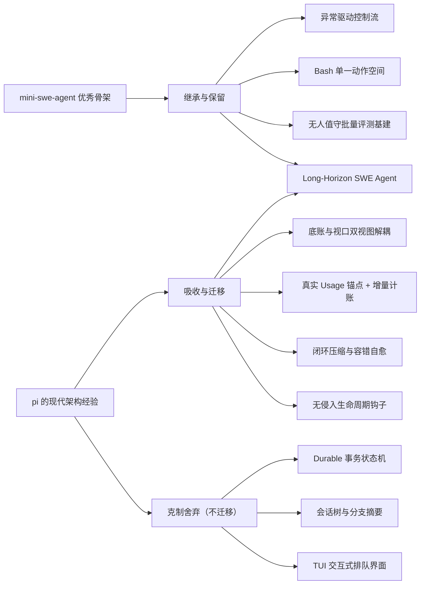
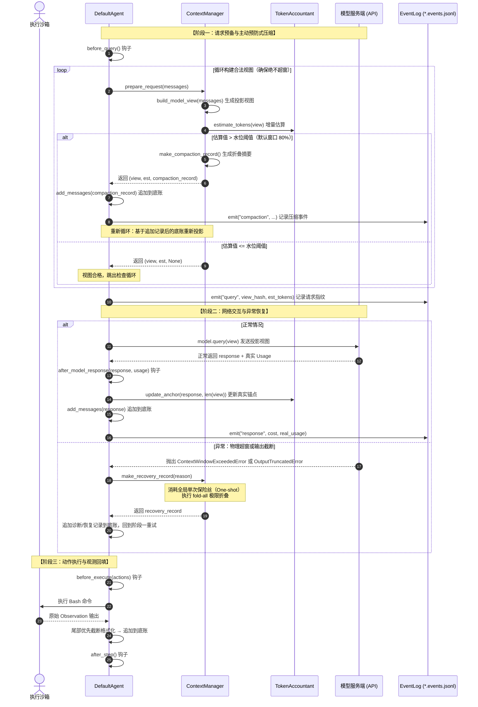
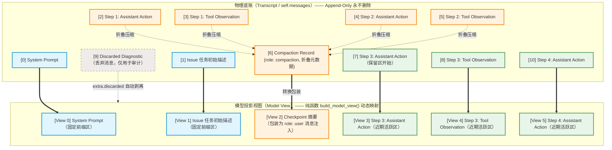
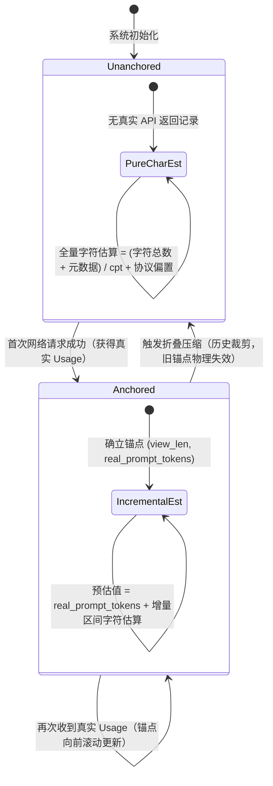
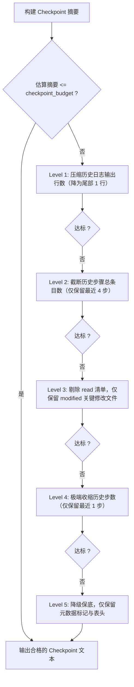

# 上下文管理与观测体系（详细设计）

本文档详细阐述 Long-Horizon SWE Agent 相对上游 [mini-swe-agent](https://github.com/SWE-agent/mini-swe-agent) 新增的**上下文压缩与全生命周期观测体系**的设计动机、架构拆解、算法细节、实测验证与生产配置指南。

新代码全部位于 `src/minisweagent/context/` 模块，配合 `DefaultAgent` 的视图投递接入点，对上游既有类不做破坏性修改。

**设计来源声明**：本体系的整体架构参考了现代工业级 coding agent [pi](https://github.com/earendil-works/pi) 的 harness 设计（底账与模型视口解耦、真实 Usage 锚定计账、闭环压缩与容错自愈、无侵入生命周期钩子），并在其基础上做了两件事：一是克制地舍弃更重的机制以保持 mini 家族的极简气质，二是把摘要落地为零 LLM 调用的确定性规则算法（fold-v1）。上游 mini-swe-agent 的极简骨架（异常驱动控制流、bash 单一动作空间、独立子进程执行）则被完整保留。

---

## 1. 问题：线性历史在长程任务下的崩溃

上游 mini-swe-agent 的哲学是 "Transcript is the Prompt"：每一步交互直接追加进消息列表，下一轮全量发送给模型。这个设计换来了极致的简单与可调试性，但代价是 Prompt 长度随步数**线性增长**：

- 32k 上下文窗口下，交互约 **8~10 轮**即触发物理爆窗异常（`ContextWindowExceededError`）；
- 上游没有超窗恢复机制，任务直接崩溃中断，无法完成 30 步以上的长程排错；
- 直接就地删减历史又会破坏轨迹完整性，污染后续微调与复盘数据——这是不可接受的副作用。

因此设计目标可以归纳为三条：

1. **物理不爆窗**：无论任务多长，发送给模型的 Prompt 永远不超出窗口；
2. **底账不删改**：完整轨迹单向追加保留，微调与复盘数据的纯度不受压缩影响；
3. **零额外 LLM 调用**：压缩过程不引入网络请求、额外费用与摘要幻觉。

## 2. 设计来源：从 mini-swe-agent 与 pi 各继承什么



另一个关键设计契约是**"调用方追加契约"**，用于保证完全的离线确定性与可重放性：

- `ContextManager` 内部所有函数均为纯函数式逻辑，只负责计算并返回待追加的压缩记录，**绝不直接修改传入的消息底账**；
- 底账的物理写入始终由 `DefaultAgent` 显式调用 `self.add_messages()` 完成；
- 这使得整套上下文演变过程可以在不启动网络与沙箱的前提下 100% 确定性重放（下文验证部分正是利用这一点）。

## 3. 架构总览

### 3.1 单步执行时序

智能体循环采用**主动预防式压缩**（Pre-emptive Compaction）与**被动响应式保险丝**（Reactive Recovery）的双层防御：



#### 单次恢复保险丝（One-shot Recovery Fuse）深入解析

在绝大多数情况下，阶段一的主动预防式压缩足以在本地完全压制上下文长度。但当遇到以下两类边界异常时，系统会触发被动保险丝：
1. **服务端物理超窗（`ContextWindowExceededError`）**：由于分词器拟合偏差或模型服务端特殊开销，实际 Token 突破物理上限；
2. **输出长度截断（`OutputTruncatedError`）**：模型输出因 `max_tokens` 耗尽被硬性截断，通常包含残缺的 JSON 或残缺命令。

**设计机制与状态流转**：
- **全局单次（One-shot）保证**：每个任务实例在运行生命周期中**仅有一次**自愈恢复机会（`recovery_used` 标记置位）。若再次触发超窗，系统坚决不再尝试压缩重试，直接抛出异常中断任务。这彻底杜绝了模型在超小窗口极限边缘陷入"超窗 → 恢复 → 再超窗"的无限死循环与 API 费用黑洞。
- **极限全量折叠（Fold-all）**：触发保险丝时，系统放弃常规的 `keep_recent_tokens` 近期保留区约束，将所有能够折叠的历史动作组全数折叠归并入 Checkpoint，最大化腾出窗口空间。
- **残缺动作安全隔离（Discarded Diagnostic）**：针对长度截断异常，截断的消息虽已产生计费，但执行残缺动作极易破坏沙箱环境（例如不完整的 `rm` 命令）。系统将截断消息标记为 `extra.discarded = True` 追加到底账，投影引擎将其在模型视图中无损屏蔽，仅保留用于审计，确保沙箱执行绝对安全。

### 3.2 双视图纯函数投影：底账与模型视图



区域划分与原子性约束：

1. **固定前缀区（Pinned Prefix）**：System Prompt 与任务描述，绝对豁免权，任何压缩算法不得折叠该区域；
2. **折叠检查点（Checkpoint）**：由最新的 `role: "compaction"` 记录转化而来，算法将其包装为标准 `role: "user"` 提示块注入模型视图；
3. **近期活跃区（Kept-recent Region）**：从切割索引 `cut_index` 开始的最近完整交互步骤，完整展现当下推理链；
4. **内部隔离机制**：底账中标记 `extra.discarded = True` 或 `role: "compaction"` 的条目由投影引擎无损剥离；
5. **动作组原子性（Action Group）**：切割索引严格依循 `split_action_groups()`。Tool-Call 模式下 `assistant.tool_calls` 与对应 `tool` 响应必须同组；Text 模式下 `assistant` 与 `observation` 绑定同组。**切割绝不落在动作组内部**，杜绝协议残缺引发模型 API 报错。

### 3.3 折叠前后的 Prompt 视图对比

任务执行到第 15 步、Token 估算触及 80% 水位线时触发自动折叠：

```markdown
<!-- 【折叠前】：模型面临长达数十步的历史堆叠，上下文逼近物理极限 -->
[system] You are a helpful software engineering agent...
[user] Issue description: Fix AttributeError in sqlglot/optimizer...
[assistant] Step 1: Let's locate the file...
[user] Observation: sqlglot/optimizer/eliminate_subqueries.py
... （中间连续 13 个步骤的完整代码展开与 pytest 报错堆栈）...
[assistant] Step 14: Let's inspect line 40...
[user] Observation: return node.args["alias"].this

──────────────────────── 触发主动折叠 ────────────────────────

<!-- 【折叠后】：通过纯函数 build_model_view() 投射给模型的实际视图 -->
[system] You are a helpful software engineering agent... （完整保留）
[user] Issue description: Fix AttributeError in ... （完整保留）

[user] <context-compaction>
The earlier conversation was automatically compacted to fit the context window.
Below is a deterministic summary of everything that happened before the recent steps.
[compacted steps | strategy=fold-v1 | reason=threshold]
files read: tests/test_optimizer.py, sqlglot/expressions.py
files modified: sqlglot/optimizer/eliminate_subqueries.py
files touched: -
[step 1] rc=0 cmd: git status
  out: On branch main
[step 3] rc=1 cmd: pytest tests/test_optimizer.py
  out: FAILED test_subquery - AttributeError: 'NoneType' object has no attribute 'this'
[step 7] rc=0 cmd: grep -n "eliminate_subqueries" sqlglot/
  out: 12:def eliminate_subqueries(expression):
... （历史步骤浓缩为关键命令与状态转移）...
</context-compaction>

[assistant] Step 14: Let's inspect line 40... （完整保留区开始）
[user] Observation: return node.args["alias"].this
```

### 3.4 混合计账机制（TokenAccountant）

**"真实 Usage 锚定 + 增量字符估算"** 的状态机：



**为什么 `chars_per_token` 默认冻结为 2.6 而不是常规的 4.0？**

- 普通英文纯文本通常按 4 字符 ≈ 1 Token 估算，但交互日志中充斥代码缩进、特殊符号（`{}[]();=`）、JSON 转义与路径分隔符，字符密度极高，实测拟合比率集中在 **2.25 ~ 3.69**；
- 若沿用 4.0，会系统性低估真实 Token 约 35%，模型误以为空间充裕导致**压缩触发偏晚，直接耗尽物理窗口硬性崩溃**；
- 冻结 2.6 使估算保持轻微偏高（保守安全方向）：宁可提前一步触发安全压缩，也绝不给底层网络留出爆窗间隙。

### 3.5 确定性折叠算法（fold-v1）

**零 LLM 调用**。传统方案调用 LLM 做长历史摘要，在评测场景下有两大缺陷：额外网络耗时与费用、摘要内容不稳定且有幻觉。fold-v1 采用纯程序化、基于命令模式与正则解析的确定性算法，毫秒级完成。

**代码文件三元分类提取**：扫描历史命令，将涉及的文件归入三类——

- `modified`（副作用/目标）：由 `sed -i`、`git checkout`、`>` 重定向触发，代表沙箱状态已被改变；
- `read`（事实依据/约束）：由 `cat`、`grep`、`pytest` 触发，明确标记已排查的边界，**防止模型陷入遗忘性重复搜索死循环**；
- `touched`（保守兜底）：复杂未知命令的兜底分类。

同一文件既被读又被改时，`modified` 状态转移权重更高，优先归入 `modified`。

**单行折叠条目的高信息性价比**：Action 与 Observation 强绑定为原子因果对：

```text
[step 2] rc=1 cmd: pytest tests/test_optimizer.py
  out: FAILED tests/test_optimizer.py::test_subquery
       AttributeError: 'NoneType' object has no attribute 'this'
```

单条消耗约 25~40 Token；即使保留满 32 条历史步骤，总消耗也仅约 1,120 Token——在 32k 窗口中占比 3.4%。

**五级自适应降级收缩阶梯**：若 Checkpoint 摘要超出预算配额，逐级收缩直至达标：



### 3.6 全生命周期观测（EventLog）与钩子

**独立审计流**：`events.py` 脱离主轨迹独立产出 `*.events.jsonl`，追加式毫秒级记录 `run_start`、`query`、`response`、`compaction`、`hook`、`exit` 事件，含状态流转、真实计费 Usage、耗时统计与压缩明细。

**指纹留痕（`view_hash`）**：每次请求发出前记录模型视图的 SHA256 前 16 位哈希。结合底账与纯函数 `build_model_view()`，可以在事后**幂等复原模型当时所见的完整 Prompt**——这是"所见即推理所见"的微调数据集构建基础，杜绝离线微调与在线推理的数据分布漂移。

**真实 `*.events.jsonl` 审计条目样例**：

```jsonl
{"ts": 1740000000.123, "event": "run_start", "context": {"window_tokens": 12288, "reserve_tokens": 2457, "keep_recent_tokens": 3072, "chars_per_token": 2.6, "strategy_version": "fold-v1"}, "model": "gpt-4o", "instance_id": "sqlglot__sqlglot-1234", "step_limit": 250, "cost_limit": 5.0}
{"ts": 1740000001.456, "event": "hook", "name": "before_query", "step": 15}
{"ts": 1740000001.460, "event": "compaction", "compaction_number": 1, "reason": "threshold", "cut_index": 28, "est_before": 9950, "est_after": 4210, "entries_compacted": 13, "files_modified": 2, "files_read": 5}
{"ts": 1740000001.465, "event": "query", "step": 15, "est_tokens": 4210, "view_len": 5, "view_hash": "a8f7c9e120b34d5e", "window_tokens": 12288, "threshold": 9831}
{"ts": 1740000003.789, "event": "response", "step": 15, "cost": 0.0125, "usage": {"prompt_tokens": 4180, "completion_tokens": 85}, "est_tokens": 4210}
{"ts": 1740000003.792, "event": "hook", "name": "after_model_response", "step": 15}
{"ts": 1740000003.805, "event": "hook", "name": "before_execute", "step": 15, "n_actions": 1}
{"ts": 1740000004.120, "event": "hook", "name": "after_step", "step": 15}
{"ts": 1740000095.678, "event": "exit", "exit_status": "Submitted", "n_calls": 28, "cost": 0.144, "n_compactions": 10, "elapsed_seconds": 95}
```

**四个无侵入生命周期钩子**（固化于 `DefaultAgent`，派生子类即可挂载策略，无需改动主循环）：

| 钩子 | 触发时机 |
| :--- | :--- |
| `before_query(messages, view)` | 模型请求发出前 |
| `after_model_response(response, usage)` | 接收到模型响应后 |
| `before_execute(actions)` | 执行沙箱动作前 |
| `after_step(step_idx)` | 单步结束落盘前 |

### 3.7 模块职责矩阵

| 模块 | 规模 | 职责与设计契约 |
| :--- | :---: | :--- |
| `context/config.py` | ~100 行 | 配置中心。参数全量可配无硬编码；`window_tokens=0` 默认保持上游原生行为；固化 `chars_per_token=2.6` |
| `context/projection.py` | ~140 行 | 纯函数投影引擎。`build_model_view()` 映射；`split_action_groups()` 保证动作与观测原子性 |
| `context/accounting.py` | ~95 行 | 混合计账引擎。真实 Usage 锚点维护、增量字符计算、压缩时锚点失效回退 |
| `context/folding.py` | ~280 行 | 信息提取与自适应收缩。读写文件集提取、fold-v1 条目格式化、五级预算收缩阶梯 |
| `context/manager.py` | ~220 行 | 总控编排器。恪守"调用方追加契约"，不擅自修改底账；管理单次恢复保险丝 |
| `context/events.py` | ~50 行 | 独立事件审计流。`*.events.jsonl` 产出，记录状态流转与压缩指纹 |

## 4. 验证证据

### 4.1 离线确定性重放

对 10 条典型的复杂历史长轨迹在模拟窗口约束下做无网络确定性重放（10 条 × {8k, 16k, 32k} 三档窗口 = 30 次）：

- **0 超预算**：所有发送给模型的视图均严格受限在窗口上限内；
- **单调性成立**：窗口由 32k 收紧至 8k，压缩触发频次严格单调递增；
- **长程受控**：70 步极限轨迹在 32k 窗口下峰值 Token 压制在 25,208（安全余量 >23%）。

### 4.2 在线 12k 极小窗口冒烟

SWE-smith 真实任务端到端实跑，强制 12k（12,288）物理窗口：

| 任务 | 退出状态 | 步数 | 压缩次数 | Token 峰值 | 计账偏差（均值/最差） | 费用 |
| :--- | :---: | :---: | :---: | :---: | :---: | :---: |
| parsimonious.func_basic | Submitted | 16 | 2 | 9,399 | 8.9% / 37% | $0.046 |
| python-qrcode.combine_file | Submitted | 28 | 10 | 9,719 | 6.9% / 34% | $0.144 |
| sqlglot.func_pm_ctrl_shuffle | Submitted | 19 | 9 | 9,821 | 9.3% / 35% | $0.122 |
| sqlglot.func_pm_remove_loop | 步数上限 | 250 | 199 | 9,874 | 7.4% / 43% | $2.117 |

关键结论：

1. 4 条任务累计 **220 次在线主动压缩，全部在本地估算层平滑完成，服务端物理爆窗 0 次，保险丝消耗 0 次**；
2. `remove_loop` 跑满 250 步，连续 199 次平稳折叠，Token 始终稳定在 9,800 左右——超长程耐力验证；
3. 稳态计账偏差 +2.6%~+8.2%（偏保守高估，安全方向）；压缩后首步因锚点失效退回字符估算出现短暂低估，下一个 API 响应即刻重新锚定。

### 4.3 测试

- `tests/context/` 45 个专项测试全绿，覆盖投影原子性、计账状态机、折叠收缩阶梯与 Agent 循环集成；
- 上游全量回归测试逐项与基线比对，确认零回归缺陷引入。

## 5. 生产配置与换模型校准

### 5.1 推荐配置

```yaml
# 32k 推荐标准生产配置
agent:
  context:
    window_tokens: 32768      # 启用上下文管理；0（默认）关闭，保持上游原生行为
    reserve_tokens: 6553      # 预留输出空间（默认 window // 5，即 80% 水位线）
    keep_recent_tokens: 8192  # 近期完整保留区（默认 window // 4）
    chars_per_token: 2.6      # 估算系数，换模型时建议重新校准
    strategy_version: "fold-v1"
  obs_max_chars: 12000        # 单条观测截断上限（尾部优先保留）
  obs_max_lines: 400
```

```yaml
# ≤12k 极小窗口防 Churn 配置
agent:
  context:
    window_tokens: 12288
    reserve_tokens: 2457      # 12288 // 5
    keep_recent_tokens: 3072  # 12288 // 4
    chars_per_token: 2.6
  obs_max_chars: 6000         # 小窗下必须等比压小，防止单条输出瞬间顶破水位
  obs_max_lines: 200
```

**防 Churn 军规**：单条观测输出上限建议不超过窗口的 15%~20%。在 ≤12k 小窗下若沿用 `obs_max_chars: 12000`，一次输出即可瞬间冲顶警戒水位，陷入"压缩 → 冲顶 → 再压缩"的恶性循环。

### 5.2 更换基座模型时的校准工作流

更换基座模型（分词词表改变）时，`chars_per_token` 需要重新校准：

1. 收集若干条该模型的历史轨迹（`traj.json` 与 `.events.jsonl` 中含真实 Usage）；
2. 对每步视图做"字符数 vs 真实 prompt_tokens"拟合，得到各轨迹的实测比率；
3. 取拟合中位数并**下浮 10%~15%**（偏保守方向）写入配置；
4. 上线后抽查 `.events.jsonl` 中预估值与真实 Usage 的偏差，稳态期控制在 +5% 左右为宜。

## 6. 工程设计准则

极限压力测试中沉淀的八项准则，供二次开发与调参参考：

**参数与算法安全**

1. **高估安全，低估致命**：`chars_per_token` 宁可取小（估算偏大），绝不取大；低估会推迟压缩直至物理爆窗。
2. **观测上限与窗口等比收缩**：小窗口场景必须同步压小 `obs_max_chars` / `obs_max_lines`，防止单条输出顶破水位造成压缩 Churn。
3. **容忍保底预算的临界微超**：命中 64-token 保底下限时整体估算可能略高于 80% 水位线，但距物理窗口仍有充足余量，属设计内行为。

**模型与 API 健壮性**

4. **输出长度截断的处理规范**：识别 `stopReason === "length"` 截断后，计费照常入账，消息标记 `discarded` 留痕，**坚决不执行残缺工具调用**，消耗保险丝极限折叠后安全重试。
5. **第三方异常严格遵循官方构造签名**：捕获/模拟 `litellm.ContextWindowExceededError` 等异常时必须按官方签名传递 `llm_provider` 与 `model`。

**测试不变量**

6. **Mock 必须维持物理不变量**：测试用 Mock 模型的 Usage 应随输入长度动态增长，否则计账系统会误判 Token 从不增长而短路折叠逻辑。
7. **身份比较优于值比较**：生成式测试中内容相同的消息对象应使用 `is` 身份校验（`not any(m is target for m in view)`），避免 `not in` 按值比较误判。

**资源运维**

8. **批量评测防御宿主机 OOM**：批量执行前清理孤儿容器、限制并发 worker；调度器基于 `preds.json` 断点续跑，机器重启后无缝接续。

## 7. 后续方向

- **微调数据集构建**：底账 + `view_hash` 支持"所见即推理所见"的幂等 Prompt 复原，为 SFT 提供零分布漂移的训练数据；
- **Harness 自演化**：四个生命周期钩子为动态策略挂载点——例如在 `before_execute` 注入 AST 语法/作弊拦截，或在 `before_query` 中依据失败模式自适应调整保留区大小；
- **折叠策略演进**：fold-v1 之后的策略版本（如引入轻量模型摘要作为可选层级）可通过 `strategy_version` 配置灰度切换。
